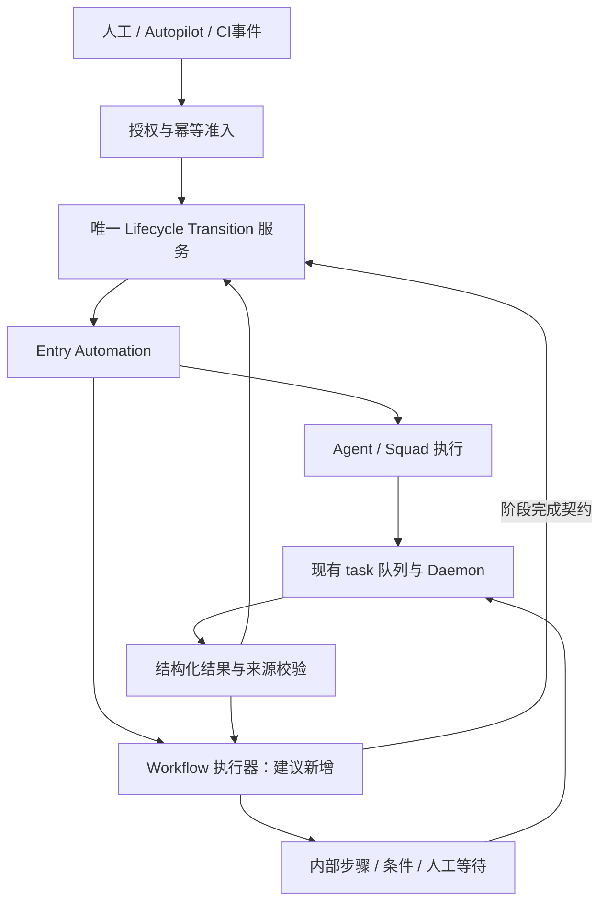

# #7990 合入后的工作流集成设计

调研日期：2026-09-07。性质：条件性架构建议，尚未实施。

关联：[上游调研与原始需求](workflow-orchestration-upstream-assessment.zh.md)、[PR #7990](https://github.com/multica-ai/multica/pull/7990)、[需求 #1943](https://github.com/multica-ai/multica/issues/1943)。

## 1. 决策摘要

**以 Lifecycle 作为任务业务状态的唯一权威，在其上补严格转换契约；只有状态内部确实需要多步编排时，才增加 Workflow 执行器。不要重新建立一套竞争性的任务状态机或 Agent 调度器。**

- 简单流程：Lifecycle 状态就是业务步骤，复用 Entry Automation 派发，增加合法边、结果校验和人工决策。
- 复杂流程：Lifecycle 状态是业务阶段，Workflow 管理阶段内部节点；通过统一转换服务提交阶段结果。
- 两种形态共享结果、版本、权限和恢复契约，不建设两套独立产品。
- 先实现串行、明确条件、有限返工、人工确认；并行、非 LLM 执行、可视化编辑依次扩展。
- 不直接迁移 GitLab LangGraph 实现，也不预先绑定 LangGraph。当前 Go/PostgreSQL 基线足以承载第一阶段的受限编排。

## 2. 证据范围

#7990 在此前页面核对时为 Open、仍在实施，不能视为已合入或已发布。初次源码阅读使用分支 `agent/emacs/042965a42844`；本次后续阅读固定提交 `2df5bebb02b405e26153a2e7e3f9125c4ae0bfa5`。初次分支读取不保证与固定提交完全一致，实施前需按最终合并提交复核。

本次直接阅读了转换服务、Entry Policy、Lifecycle SQL、生命周期服务、状态编辑 Handler、task 服务、策略适配器和执行状态同步迁移。没有运行远程分支，没有完成所有 Handler/CLI/批量入口的权限审计；部分 Handler URL 抓取失败。下文区分“已观察行为”和“建议新增”，不将待验证能力当成已交付。

## 3. #7990 已提供什么，以及容易误读的地方

| 领域 | 已观察实现 | 对工作流的含义 |
| --- | --- | --- |
| 生命周期归属 | 工作区默认、项目自定义；任务绑定 Lifecycle；项目默认指针变化不迁移既有任务 | 复用归属规则，不增加逐任务生命周期覆盖 |
| 状态身份 | 稳定状态 ID、Phase、旧状态投影 | 边引用 ID，不以名称或排序定义依赖 |
| 转换事务 | 锁任务、校验可选 revision/transition、更新状态与负责人、记转换、替代旧执行、取消关联 task、创建新执行及 task | 这是唯一业务转换基础，不在外部另写状态 |
| 初始进入 | 任务创建事务内应用初始 Entry Policy | 启动不能再由 Autopilot 或 Workflow 重复派发 |
| 执行者 | 当前接受 `none`、`agent`、`squad`；小队解析为当前队长 | 小队仍是自主协调，不是固定角色依赖图 |
| 进入策略 | 分开定义负责人、执行者、指令和 `advance` | 负责人不必等于执行者；权限模式不是路由规则 |
| 执行审计 | `automation_execution` 捕获本次策略快照，并关联触发转换和 task | 可复用每次进入状态的执行身份 |
| 版本 | 定义行原地修改并递增 revision；每次进入读取目标当前策略 | revision 不是不可变整图；本次快照不冻结未来步骤 |
| 同节点请求 | 当前节点等于目标节点时直接 no-op | 重试不能靠“再改一次相同状态”实现 |
| 人工接管 | 替代当前执行、转交给人、取消关联 task | 接管不等于 approve/reject，也不会自动选择后继 |
| 状态管理权限 | 已读的状态编辑入口要求工作区 owner/admin，并校验策略引用 | 不代表所有运行期转换的授权已审计完成 |

### 3.1 执行完成不是业务验收通过

固定提交的 `CompleteTask` 明确不自动修改任务业务状态。执行完成可以生成展示评论，但不是通过业务验收的证据。

执行状态同步触发器会把关联 task 的状态映射到 `automation_execution`：`deferred/queued` → `queued`，`dispatched/running/waiting_local_directory` → `running`，终态直接映射；`superseded` 不被迟到更新覆盖。系统重试的 queued/deferred 插入允许重新打开终态执行。

**该机制不是多节点聚合器。** 如果把并行或串行子 task 全部直接挂到同一个父 `automation_execution`，第一个子 task 完成就可能把父执行标为 completed。后续设计必须改变聚合责任，不能仅增加一个关联字段。

### 3.2 生命周期不是严格状态图

已读转换服务校验目标是否属于当前生命周期且未归档，但不能据此认定存在通用合法边、结果条件或前置证据校验。`executor_may_transition` 仅表达执行者可请求转换；`human_confirms` 不能自动等同于持久化审批记录。

Phase 中的 `started` 包含实现、评审、阻塞等语义。已读 `issuepolicy` 仍用旧 category 区分部分策略，例如自动化在 `in_review` 视为完成、在 `blocked` 视为失败。因此不能把“进入评审”直接解释为整条工作流完成。

### 3.3 全入口切换是前提

已读代码中完整状态节点转换与旧状态转换仍有差异；TaskService 的失败恢复仍存在旧转换调用。PR 本身也列有 canonical write cutover 待办。

集成前应逐项审计：创建、单项更新、批量更新、拖拽、CLI/MCP、Agent 回写、CI/Webhook、失败恢复、父子任务处理。严格流程的非法跳转必须由服务端统一拒绝；不能只隐藏前端选项，也不能给 `system` actor 无条件绕过权。

## 4. 推荐的分层模型

图中的两条结果路径按执行模式择一，不允许一个结果被两个控制器独立推进。

| 对象 | 权威职责 | 不应承担 |
| --- | --- | --- |
| Lifecycle / `issue.lifecycle_status_id` | 对外业务阶段、状态转换审计 | 全部内部并行步骤 |
| `automation_execution` | 某次进入状态的自动化执行 | 整条跨状态工作流的所有历史 |
| Workflow run（新增） | 冻结定义、步骤进度、条件和等待 | 直接写业务状态、另建 Agent 队列 |
| Node visit / attempt（新增） | 第几次访问节点、尝试与结果来源 | 将技术重试冒充业务返工 |
| task / Daemon | 一次实际执行及基础设施重试 | 判断业务批准、任意选择后继 |

一个任务最多有一个活跃的严格流程控制器；内部可以多 task 并行。普通评论和提及可以按显式策略作为辅助协作，但它们没有推进权，也不能被当成流程节点结果。

### 4.1 第一层：严格 Lifecycle 流程，优先实现

适用于“规划 → 实现 → 评审 → 人工确认 → 完成”。

1. 以稳定状态 ID 定义允许边，每条边包含明确的 condition、证据要求、操作者要求。
2. 复用状态进入策略派发 Agent/Squad；Workflow 层只验证、记录和选择合法后继，不再次 enqueue。
3. 一次跨状态 run 关联多条既有 transition 和 automation execution，不取代它们。
4. 只提供结构化结果提交与人工决策，不让模型根据评论自由猜测路径。
5. 同一 from/condition 必须唯一确定后继；未匹配、结果非法或证据缺失时停留并显示原因，不默认跳到下一列。

如果业务仅要求进入状态自动派发，不要求强顺序、冻结或验收，则直接使用 #7990，无需建立 Workflow run。

### 4.2 第二层：状态内 Workflow 执行器，按需实现

适用于“实现”阶段内部有代码修改、测试、扫描、打包，而看板不应出现所有技术步骤。

Entry Policy 源码注释明确为未来 workflow executor 留出 JSON 扩展空间，但当前校验只允许 `none/agent/squad`。建议将 `workflow` 作为新增执行类型 RFC，而不是声称现有接口已支持。

- 一次进入阶段创建一个父 `automation_execution` 和阶段内 run；内部步骤不直接更改任务状态。
- 子 task 通过节点尝试关联 run；不能直接套用现有“单 task 状态映射父执行”逻辑。
- 建议父执行由 Workflow 协调器聚合；原 Agent/Squad 的同步规则保持不变。引入执行类型分流，并明确旧 SQL 触发器对 Workflow 子 task 不生效。
- Workflow 等待人时，不占用一个空转 Agent task；等待与超时持久化，由数据库调度恢复。
- 阶段结束时提交一个结构化阶段结果，再通过统一转换服务进入下一状态。
- 不允许外层严格流程和内层 Workflow 同时决定下一业务阶段：内层只产出 outcome，外层契约决定路由。

## 5. 最小新增数据契约

以下为设计草案，不是 #7990 已存在的实体或稳定 API。

| 建议对象 | 最小内容 |
| --- | --- |
| `workflow_definition_version` | 不可变定义、schema 版本、内容摘要、状态 ID 映射、结果契约、重试预算 |
| `workflow_run` | 工作区、任务、固定定义版本、生命周期 ID、绑定快照、控制模式、revision、取消代次 |
| `workflow_node_run` | run、逻辑节点、visit 序号、当前 attempt、等待类型、到期时间 |
| `workflow_node_attempt` | node run、task、技术尝试链、执行身份、输入/产物引用、终态 |
| `workflow_result` | 来源 task/attempt、condition、summary、证据引用、幂等键、接收与采用状态 |
| `workflow_decision` | 人工操作者、approve/reject 等枚举、证据版本、理由、被决定的节点访问 |
| 持久化事件/待处理意图 | 转换、恢复、超时和外部派发的幂等键、待处理状态、重试时间 |

优先复用满足相同事务与投递契约的现有 outbox 基础设施；不足时增加领域表，不强行复用普通评论作为控制日志。新增表遵循单数 snake_case、无数据库外键、应用层事务清理、双向迁移、每个 concurrent index 独立迁移。

### 5.1 冻结必须覆盖未来步骤

跨状态严格流程不能仅存 `lifecycle_revision`。发布时保存执行相关定义及角色绑定；新 run 使用新版本，既有 run 保持旧版本。

**必须补一个进入策略解析扩展点：**受控 run 按已授权的固定快照生成 Entry Policy，普通任务仍读取当前 Lifecycle 配置。若最终上游不接受该扩展，可暂时对被活跃 run 引用的执行策略修改/归档实行阻止规则；不能声称仅复制 JSON 就获得了端到端冻结。

状态归档会让现有目标准入失败。第一版建议禁止归档仍被活跃严格 run 的后续路径引用的状态，显示受影响运行；需要强制变更时先暂停并显式迁移或取消。不得偷偷映射到同名状态。

角色身份与指令可冻结，但权限不可永久冻结：每次派发重新检查工作区成员资格、Agent 调用权、归档及 runtime 可用性。小队成员变化不能无声改变固定角色绑定；重新绑定须经授权并留痕。

## 6. 推进、重试与恢复协议

### 6.1 推荐事务边界

当前完整转换函数自开事务。建议拆出接受事务句柄的内部转换原语，并保持一个公开事务入口，供以下流程组合：

1. 按统一锁顺序锁任务、run、节点访问及相关执行；所有结果、接管、取消和超时路径遵守相同顺序。
2. 验证工作区、调用身份、run revision、当前 transition、节点 visit/attempt、取消代次及证据版本。
3. 以幂等键记录结果/决策并验证 schema；重复相同提交返回原结果，冲突内容拒绝。
4. 决定唯一合法边；通过同事务的 Lifecycle 原语更新业务状态、记录转换、应用进入策略、创建后继执行及 task。
5. 更新 run 进度并记录持久化待处理事件；提交后才通知 Daemon 和前端。

无法组成同一事务时，必须采用“结果接收 + 待推进意图”原子提交，再由幂等消费者推进并对账。不能采用“存结果后调用一次 HTTP 改状态，失败就丢弃”的模式。

结果可以先提交为候选；默认须等待当前有效技术尝试链成功结束才采用。执行 completed 但无合格结果时应显示“缺少流程结果”，不能当作通过。人工确认绑定的是已采用结果及其产物版本。

### 6.2 两种重试分开计数

- 基础设施重试：复用现有 task 重试链，属于同一次节点访问；必须保持节点关联及 fencing。不要同时由 Workflow 再派发一个同义重试。
- 业务返工：如评审 `CHANGES_REQUIRED` 返回实现，创建新的 visit 和相应进入执行，保留旧结果。
- 同节点人工重试：明确 API，递增 attempt、废止旧尝试；不是同状态 no-op 转换，也不是普通历史 task rerun 的无条件复用。
- 设置总尝试、返工次数、运行时长、模型费用预算；任何一项耗尽都停止自动推进并要求人工处理。

固定提交的状态同步触发器可为系统重试重开 execution。需要测试关联字段继承、乱序回调以及失败后离开状态再重试；不能只依赖 `superseded`，因为已有替代查询主要处理 pending/queued/running，失败执行是否仍属当前进入必须再次验证。

### 6.3 取消与人工接管

接管事务使 run/节点旧代次失效、停止后续派发、取消所属 task，再把控制权交给人。明确选择“暂停后恢复”或“终止自动控制”，不能接管后仍由结果消费者自动推进。

已经发出的外部动作无法通过数据库取消撤销；仅保证不会采用旧结果继续推进，不承诺外部副作用 exactly-once。Webhook/命令使用独立业务幂等键；补偿步骤必须显式设计。

超时以数据库时间和持久化 deadline 为准；超时处理与结果竞争同一个条件更新。进程重启由扫描和对账恢复，WebSocket/Redis 消息只负责加速与刷新，不是正确性的唯一依据。

## 7. 与现有产品的衔接

### 7.1 自动化与小队

- Autopilot 保留手动、计划和 Webhook 启动职责。工作流绑定应是显式 opt-in，不改变普通 `create_issue` / `run_only`。
- `create_issue` 的初始进入策略与历史分配触发只能有一个派发责任方，需做重复触发回归测试。
- 严格流程下不要沿用“进入评审即 Autopilot 完成”的隐含规则；明确外层自动化运行何时完成，推荐以 run 的终态契约为准。
- 第一版要求工作流有承载任务；不把既有 `run_only` 默认为跨阶段流程。
- 小队作为一种节点执行器保留自主协调。严格步骤角色绑定不能只依赖小队角色描述；节点结果必须来自获准执行链。

### 7.2 API、CLI、SDK 与界面

- 保留统一业务转换入口，新增结果提交、人工决定、重试、暂停/恢复与取消操作；具体路由待最终上游 API 稳定后确定。
- 客户端不能指定任意可信 `source_task_id`；服务端从 task 身份推导，并验证关联。人工操作用人类身份，不能伪装成 Agent 完成。
- 返回当前合法动作及禁止原因，例如缺证据、待人确认、陈旧版本；前端只展示，服务端每次重验。
- 项目 Lifecycle 设置增加受控流程绑定、dry-run、副作用预览；任务详情复用状态、转换历史、自动化执行面板，增加节点进度和决策卡片。
- 内部步骤不是看板新状态；先做时间线/步骤列表，后做可视化画布。
- Web/Desktop 共享 API/Query 和业务视图；Mobile 独立适配。旧客户端即便不识别流程，也不能通过旧写入口绕过控制。
- CLI、Python SDK、MCP 使用相同契约；同步更新 schema、错误处理和内置 skill 指引。
- AI Builder 只生成草案；讨论不写配置，显式提案后 dry-run，人工确认才发布。发布与运行采用相同版本模型。

### 7.3 非 LLM 步骤

#7990 没有因此获得原生命令/HTTP 执行能力。参考 #6202 单独设计获准命令入口、版本摘要、结构化输入输出、超时和资源限制；不启动模型代跑确定性脚本。HTTP 节点需防 SSRF、鉴权与重放，凭据存引用而非模板明文。

## 8. 建议实施顺序与验收门槛

| 阶段 | 交付范围 | 进入下一阶段的条件 |
| --- | --- | --- |
| P0：合并基线验证 | 固定最终提交，验证迁移、全转换入口、策略消费者与客户端兼容 | 无重复派发、无受控状态写入旁路，回滚/在途处置明确 |
| P1：严格串行闭环 | 合法边、不可变版本、结构化结果、人工确认、有限返工、持久化恢复 | 正常与故障路径均可审计、可恢复 |
| P2：状态内执行 | Workflow executor、父执行聚合、节点重试与等待 | 子 task 不能提前完成父执行，接管后不继续推进 |
| P3：确定性与并行 | 命令/HTTP、受限 fork/join、并发与成本预算 | join 幂等、失败策略明确、无重复外部动作假设 |
| P4：配置体验 | 模板编队、可视化 Builder、AI 提案、导入导出 | 草案/发布隔离，跨项目引用可校验且无凭据泄露 |

必要测试：

1. 规划结果通过后只派发一次实现；未知 condition 不推进。
2. 评审退回后生成新 visit，旧 task 的迟到通过结果被拒绝。
3. completed 无结果、结果已交但 task 失败、系统重试尚未终结，均不误进入下一业务步骤。
4. 双击批准、两个消费者、结果与超时竞态，只产生一个生效决定及一次后继派发。
5. 人工接管/取消后 task 回调、重试扫描、评论和失败恢复均不能复活流程。
6. 执行中修改未来节点指令、角色或归档状态，符合冻结/阻止规则；新 run 使用新版本。
7. 多子 task 共享阶段时，第一个完成不提前完成父 execution；join 重放不重复推进。
8. 提交后通知丢失、消费者崩溃和服务器重启能通过持久化记录恢复。
9. `in_review` / `blocked` 的兼容策略不误判严格 run 的终态。
10. 跨工作区、被撤销权限、伪造 task 来源、过期审批和旧客户端跳步均被拒绝。
11. 普通任务、小队、评论提及及两种 Autopilot 模式保持原行为。

## 9. 建议与上游先对齐的五个接口契约

1. 是否接受事务内 Transition 扩展点，供严格准入与结果推进复用？
2. 是否接受按 run 固定版本解析进入策略，而非始终读取当前策略？
3. `executor.type = workflow` 是否是认可的扩展方向，父 execution 如何聚合？
4. 所有写入、后台恢复及安装版客户端何时完成 canonical transition cutover？
5. 接管、归档、权限撤销、功能关闭及在途回滚的统一行为是什么？

不必等完整 DAG 路线图才能推进 P1，但不能在这些边界尚不清楚时投入完整引擎。本文未向上游发送评论或修改生产环境。

## 10. 源码依据

以下链接均为上游源码，不表示这些文件已存在于本地基线。

- [转换事务与初始进入：分支读取来源](https://github.com/multica-ai/multica/blob/agent/emacs/042965a42844/server/internal/service/issue_transition.go)
- [Entry Policy 与未来执行类型扩展注释：分支读取来源](https://github.com/multica-ai/multica/blob/agent/emacs/042965a42844/server/internal/issuelifecycle/entry_policy.go)
- [定义更新、执行去重与替代查询：分支读取来源](https://github.com/multica-ai/multica/blob/agent/emacs/042965a42844/server/pkg/db/queries/issue_lifecycle.sql)
- [默认继承及转换记录：分支读取来源](https://github.com/multica-ai/multica/blob/agent/emacs/042965a42844/server/internal/issuelifecycle/issuelifecycle.go)
- [状态编辑权限与归档：固定提交](https://github.com/multica-ai/multica/blob/2df5bebb02b405e26153a2e7e3f9125c4ae0bfa5/server/internal/handler/issue_lifecycle_status.go)
- [task 完成、重试及后台失败恢复：固定提交](https://github.com/multica-ai/multica/blob/2df5bebb02b405e26153a2e7e3f9125c4ae0bfa5/server/internal/service/task.go)
- [执行状态同步触发器：固定提交](https://github.com/multica-ai/multica/blob/2df5bebb02b405e26153a2e7e3f9125c4ae0bfa5/server/migrations/465_automation_execution_task_status.up.sql)
- [Phase 与旧 category 策略适配：固定提交](https://github.com/multica-ai/multica/blob/2df5bebb02b405e26153a2e7e3f9125c4ae0bfa5/server/internal/issuepolicy/issuepolicy.go)

验证范围：本次仅做源码分析与文档检查，不包含远程分支的编译、数据库迁移、并发测试或生产验证。